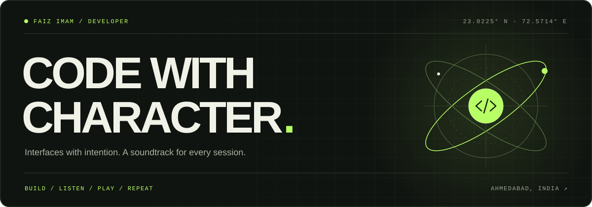

<div align="center">

[GITHUB](https://github.com/Faiziimam) &nbsp; ↗ &nbsp; [LINKEDIN](https://www.linkedin.com/in/faiziimam/) &nbsp; ↗ &nbsp; [SAY HELLO](mailto:faizkalwara@gmail.com)

**A developer with a musician's ear and a gamer's curiosity.**

I build for the web. I care about the details. There's usually a playlist involved.

</div>

<br>

### 01 / the toolkit

<p>
  
  
  
  
  
</p>

Also in the mix: **HTML · CSS · Vue**

### 02 / current rotation

| Building depth | Exploring next | Beyond the screen |
| :--- | :--- | :--- |
| React & thoughtful interfaces | Azure, Node & music | Cricket, gaming & anime |

### 03 / the human behind the commits

```js
const faiz = {
  location: "Ahmedabad, India",
  fuel: ["curiosity", "coffee", "music"],
  approach: "make it work, then make it feel right",
  sideQuest: "just one more anime episode"
};
```

<br>

<div align="center">

<sub>LESS NOISE. MORE CHARACTER.</sub>

</div>
